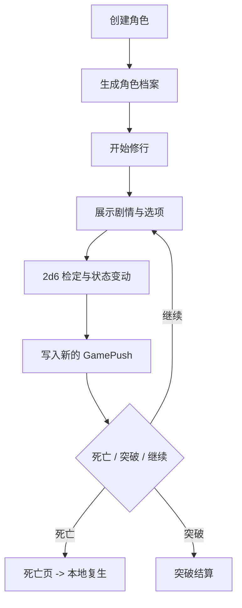
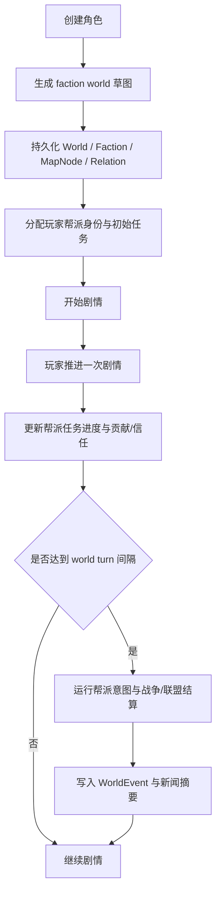
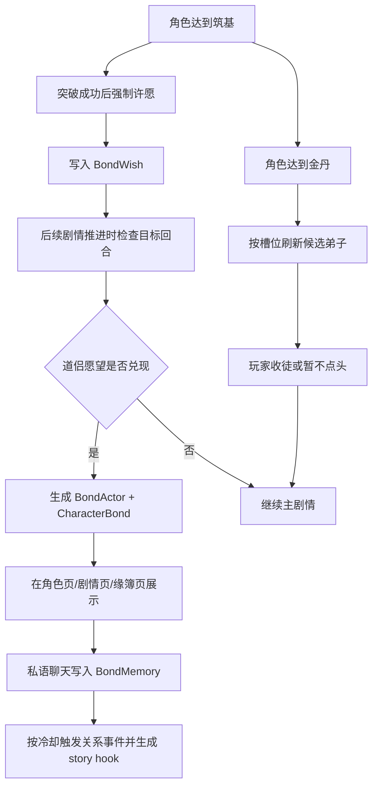

# MOB.AI 项目架构档案

> 2026-03-20 更新：
> 当前仓库已经完成 Phase 1 的开源单机化落地，完成 Phase 2 的 faction/world 系统，并进入 Phase 3 的 relationship/bond 层。运行时事实已经从“PostgreSQL + Redis + 远程配置 + 远程静态资源 + 支付/登录分支”切换到“SQLite + 本地配置 + 本地资源 + 单机默认用户 + `/mcp` + 帮派外循环世界模拟 + 统一 NPC Bond 底座”。

## 1. 当前定位

MOB.AI 当前是一个以修仙题材为核心的 AI 驱动叙事游戏仓库。它仍然是一个 Next.js 单体应用，但已经具备三层同时运行的能力：

- 玩家本地游玩的前端与主流程
- 本地配置和持久化驱动的服务端动作
- 对外暴露给 agent 的 MCP / skills 接口

这份文档记录的是“当前事实架构”，用于后续继续迭代 faction/world 与 relationship/bond 层。

## 2. 技术栈与运行时

| 层级 | 当前实现 |
| --- | --- |
| Web 框架 | Next.js 15 App Router |
| UI | React 18 + Tailwind CSS v4 + 少量 Radix UI |
| 客户端状态 | Recoil |
| ORM / 数据库 | Prisma + SQLite (`prisma/dev.db`) |
| 配置中心 | 本地 JSON 配置 (`data/local-config.json`) |
| AI 调用 | Vercel AI SDK + `stableGenerateObject` |
| 模型路由 | `src/utils/modelAdapter.ts` |
| 媒体 | `public/assets/` + `public/generated/` |
| 用户模式 | 单机默认用户自动创建 |
| 图像生成 | 可选功能，默认关闭 |
| 埋点 | 默认关闭，可选开启 |
| Agent 兼容 | MCP (`/mcp`) + `skills/*/SKILL.md` + OpenClaw 示例配置 |

## 3. 顶层目录地图

```text
.
├── src/
│   ├── app/                     # App Router 页面、Server Actions、游戏主流程
│   ├── interfaces/              # schema、DTO、共享类型
│   ├── lib/                     # Prisma、本地配置、MCP、错误处理等基础设施
│   └── utils/                   # 模型适配、Prompt/配置桥、AI 工具
├── prisma/                      # SQLite schema
├── scripts/                     # SQLite 初始化、资源同步
├── public/
│   ├── assets/                  # 本地 UI 资源
│   └── generated/               # 本地生成图片
├── skills/                      # 标准 SKILL.md 资产
├── openclaw/                    # OpenClaw 示例配置
└── docs/                        # 架构、规则、roadmap、重构设计
```

## 4. 应用层结构

### 4.1 前端壳层

- `src/app/layout.tsx`
  - 注入全局样式。
  - 按本地配置决定是否启用 Umami。
- `src/app/ClientRoot.tsx`
  - 包裹 `RecoilRoot`、`ToastProvider`。
  - 渲染固定头部与设置入口。
  - 负责本地用户状态在客户端的同步。

### 4.2 游戏页面层

- `src/app/components/PageLayout.tsx`
  - 主流程容器，靠 Recoil `pageState` 在 `home/create/loading/char/story` 间切换。
- `src/app/components/PageHome.tsx`
  - 首页、角色列表、快速开局、导入分享入口。
- `src/app/components/PageCreateChar.tsx`
  - 灵根、属性点、姓名、角色背景创建。
- `src/app/components/PageChar.tsx`
  - 角色档案、立绘、开始修行入口。
  - 当前也承载 faction 与 bond 的轻量入口。
- `src/app/components/PageStory.tsx`
  - 剧情展示、掷骰演出、选项推进、自定义输入、死亡/突破跳转。
  - 在突破成功后承载“道侣许愿”强制节点，并展示关系侧栏摘要。
- `src/app/pages/*`
  - 独立路由页，目前保留历史、设置、死亡、头像、世界地图等页面。
  - 关系系统新增 `pages/bonds` 与 `pages/bond-chat`。

### 4.3 服务端动作层

`src/app/actions/**` 是当前应用真正的后端接口层，核心包括：

- `character/action.ts`
  - 创建角色、获取角色、突破、复生，并在角色创建/读取时注入 faction / bond 数据。
- `game/action.ts`
  - `startGame()`、`pushGame()`。
- `faction/action.ts`
  - 读取角色对应的 faction 世界快照。
- `bond/action.ts`
  - 读取关系快照、提交道侣愿望、收徒/拒绝候选、私语聊天。
- `settings/action.ts`
  - 本地模型配置、Prompt 模板、功能开关、连接测试。
- `revive/action.ts`
  - 单机复生动作。
- `story_segment/action.ts`
  - 剧情片段读取。
- `image-generation/action.ts`
  - 可选剧情配图触发。

### 4.4 游戏领域服务层

当前规则仍然没有被完全抽成独立 `domain/`，主要逻辑集中在：

- `GameCharacterRefactored.ts`
  - 主协调器，负责角色装载、推进、突破/死亡判定、current push 切换，并在响应里注入 faction / bond 载荷。
- `GamePushService.ts`
  - 创建剧情推进、调用 LLM、落库新 push，并把 faction / bond 世界上下文注入故事 Prompt。
- `OptionService.ts`
  - 选项推进与预加载衔接。
- `PreloadService.ts`
  - 给选项提前掷骰并准备结果。
- `factionSystem.ts`
  - 负责世界生成、帮派关系、地图节点、帮派任务、外循环 world turn、旧存档补建与 UI payload 组装。
- `bondSystem.ts`
  - 负责统一 NPC Bond 底座、道侣愿望兑现、弟子候选刷新、关系记忆、轻量事件编排、聊天与剧情上下文注入。
- `checkSystem.ts`
  - 2d6 检定规则。
- `attributeSystem.ts`
  - 状态初始化、状态变化、死亡判定。
- `OptionAnalysisService.ts`
  - 自定义输入的动作分类和难度分析。

### 4.5 基础设施层

- `src/lib/prisma.ts`
  - Prisma 单例。
- `src/utils/config-client.ts`
  - 本地配置桥，保留旧 `ConfigService` 形式以减少业务改动。
- `src/lib/local-config/*`
  - 默认 Prompt Pack、本地配置存储、设置页读写接口。
- `src/lib/local-user.ts`
  - 单机默认用户引导。
- `src/lib/local-media.ts`
  - 本地图像落盘。
- `src/lib/mcp/server.ts`
  - MCP server 定义，并暴露 faction 设计/roadmap 等资源。
- `src/utils/modelAdapter.ts`
  - 把本地配置映射到 AI SDK provider。
- `src/utils/stableGenerateObject.ts`
  - 统一对象生成、修复、重试、日志落库。

## 5. 关键运行流程

### 5.1 主游戏循环



### 5.2 导航模型

当前仍是双轨结构：

- 主游戏循环使用 Recoil `pageState`
- 历史、死亡、设置、头像使用 App Router 独立页面

当前 faction 地图已经采用独立页面 `src/app/pages/world/page.tsx`，并在角色页、故事页通过入口按钮跳转。

### 5.3 帮派外循环



### 5.4 关系外循环



## 6. 数据模型

### 6.1 当前关键表

| 模型 | 作用 |
| --- | --- |
| `User` | 本地单用户主体，含复生状态 |
| `Character` | 角色档案、加点、灵根、当前推进指针 |
| `World` | 帮派世界种子、world turn、季节、新闻摘要 |
| `MapNode` | 世界节点图上的山门、坊市、渡口、秘境等 |
| `Faction` | 帮派势力、目标、首府、控制节点与风格摘要 |
| `FactionRelation` | 势力间关系分数、关系类型、最近原因 |
| `CharacterFactionState` | 玩家在帮派中的身份、贡献、信任、地位、当前节点 |
| `FactionMission` | 帮派派给玩家的任务与奖励 |
| `WorldEvent` | 战争、结盟、占领、任务完成等世界事件 |
| `BondActor` | 关系 NPC 的静态画像 |
| `CharacterBond` | 道侣/弟子的运行态关系、阶段、数值与摘要 |
| `BondMemory` | 关系记忆摘要与聊天片段 |
| `BondWish` | 道侣愿望、结构化偏好与兑现状态 |
| `GamePush` | 每一步剧情推进节点 |
| `StorySegment` | 与推进一对一的剧情片段快照 |
| `Avatar` / `AvatarTask` | 角色头像与生成任务 |
| `Dictionary` | 兼容旧逻辑的字典表 |
| `PromptHistory` | Prompt 版本记录 |
| `LlmCallLog` | LLM 调用日志 |

### 6.2 当前关系重点

- `Character.currentPushId` 指向当前剧情节点
- `Character.worldId` 把角色接到 faction/world 层
- `Character.bondActors / bonds / bondWishes` 把角色接到 relationship/bond 层
- `Character.gamePush[]` 保存推进历史
- `Character.factionState` 维护帮派身份、贡献、当前任务
- `CharacterBond.actorId` 把静态 NPC 画像与关系运行态拆开
- `BondMemory.bondId` 维护关系对话与关键事件摘要
- `BondWish.fulfilledBondId` 把“许愿”与“兑现后的道侣”串起来
- `GamePush.fatherId` 形成推进树
- `StorySegment` 与 `GamePush` 一对一
- `World -> Faction -> MapNode / FactionRelation / WorldEvent` 组成世界外循环骨架
- `Character -> BondWish -> CharacterBond -> BondMemory` 组成长期关系外循环骨架
- 复生不重建角色，而是重置状态并继续角色生命线

## 7. 配置与模型链路

当前 Prompt 与模型配置已经本地化，但业务层仍保留“配置服务”抽象：

- `ConfigService.getConfig(name)` 现在读取本地配置文件
- 每个配置项包含：
  - provider
  - base URL
  - API key
  - model name
  - system prompt / user prompt
  - thinking / feature 参数
- `modelAdapter.ts` 再把这些配置映射到 AI SDK providerOptions

这让旧代码改动面较小，但也意味着“本地配置中心”目前仍是兼容层，不是纯净的新设计。

## 8. Agent 暴露层

### 8.1 MCP

- 路径：`src/app/mcp/route.ts`
- 协议：标准 Streamable HTTP MCP
- SDK：`@modelcontextprotocol/sdk`
- 入口：`POST /mcp`

当前暴露：

- tools：角色查询、角色创建、开始游戏、推进、突破、设置读取
- resources：架构文档、规则文档、roadmap、faction 设计文档、skills、Prompt 模板
- prompts：重构顾问、游戏主持

### 8.2 Skills

仓库当前提供：

- `skills/mobai-gameplay/SKILL.md`
- `skills/mobai-refactor/SKILL.md`

文件格式为 YAML frontmatter + Markdown body，面向 Claude Code / Codex / Cursor / OpenClaw 风格工作流。

### 8.3 OpenClaw

- 示例配置在 `openclaw/example-config.json`
- 文档在 `docs/OPENCLAW_INTEGRATION.md`

## 9. 当前前端设计语言

后续重构必须保留以下视觉资产：

- 宣纸感浅米底色 `#F2EBD9`
- 黑墨 / 深褐色文字，而不是通用后台对比色
- 古籍/明朝体取向
- 大量图片化按钮
- 移动端全屏叙事感
- 五行色系和金色点缀

换句话说，Phase 2 的 faction/map 已经按这个方向落地，不能退化成普通管理后台或标准沙盒地图。

## 10. 当前重构热点

### 10.1 导航双轨制

主循环与独立路由页并存。当前 faction/map 已经进入独立路由页，但与 Recoil 主循环仍有状态桥接成本。

### 10.2 领域与持久化强耦合

`GameCharacterRefactored`、`GamePushService` 既管规则又直接打 Prisma，后续适合拆成 domain + repository + orchestration。

### 10.3 本地用户态双存储

cookie、`localStorage`、Recoil 同时存在，SSR/CSR 一致性仍有维护成本。

### 10.4 配置兼容层仍然较厚

代码已经摆脱远端 config service，但 `ConfigService` 语义仍在。后续可以考虑彻底改成显式本地配置仓储。

### 10.5 帮派世界仍以代码模拟为主

当前帮派 AI 采用“代码掌控状态，LLM 负责叙事上下文”的混合模式。后续如果要继续增强自治深度，应保持这个边界，不要把可验证规则重新交还给模型。

### 10.6 关系系统同样采用代码控状态

当前 bond 系统也沿用相同边界：

- 代码控制解锁、槽位、候选刷新、愿望兑现、数值结算、记忆裁剪
- LLM 只负责愿望结构化、私语回复、关系事件包装与剧情风味

这保证了“道侣一定兑现”“弟子槽位稳定”“主循环不被关系系统抢走控制权”。

### 10.7 文档与代码要持续对齐

旧支付/后台文档已经不再代表当前产品，后续开发应以 `README.md`、`docs/ROADMAP.md`、当前源码为准。

## 11. 面向后续 Phase 的直接建议

- faction 不要重写主流程，而是作为世界上下文层插入
- 地图先做节点图 / 区域图，不直接上复杂 tile map
- world loop 要让代码掌握状态与结算，LLM 只负责意图和叙事增色
- MCP 资源层后续可以直接补 faction/world 文档、世界状态摘要、地图资源
- relationship/bond 后续也应继续沿用统一底座，不要把道侣和弟子拆成两套平行状态机
